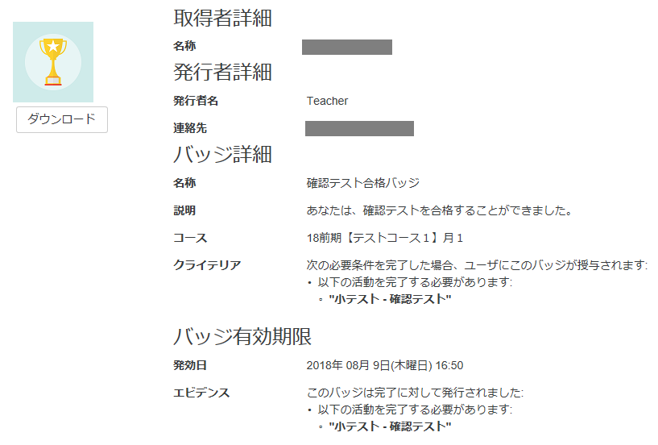

# 獲得したデジタルバッジを確認するには

### 通知から確認する

1. バッジを獲得すると、画面右上の通知アイコンに、通知が追加されます。「通知詳細を表示する」をクリックすると、メッセージの内容が表示されます。  
2. バッジの名前をクリックすると、バッジの情報が表示されます。「バッジを管理する」をクリックすると、これまでに獲得したバッジの一覧が表示されます。

バッジの情報

これまでに獲得したバッジ

### プロファイルから確認する

1.画面右上のプロファイルをクリックします。‌  
通知から確認する  
‌  
1.バッジを獲得すると、画面右上の通知アイコンに、通知が追加されます。「通知詳細を表示する」をクリックすると、メッセージの内容が表示されます。  
  
​  
  
​  
  
‌  
2.バッジの名前をクリックすると、バッジの情報が表示されます。「バッジを管理する」をクリックすると、これまでに獲得したバッジの一覧が表示されます。  
  
​  
  
​  
  
‌  
バッジの情報  
  
‌  
これまでに獲得したバッジ  
  
‌  
プロファイルから確認する  
‌  
1.画面右上のプロファイルをクリックっっっっっっっっっっっっっっっっっっっっｆ

2.プロファイルの画面に、取得したバッジが表示されます。バッジの名前をクリックすると、バッジの情報が表示されます

